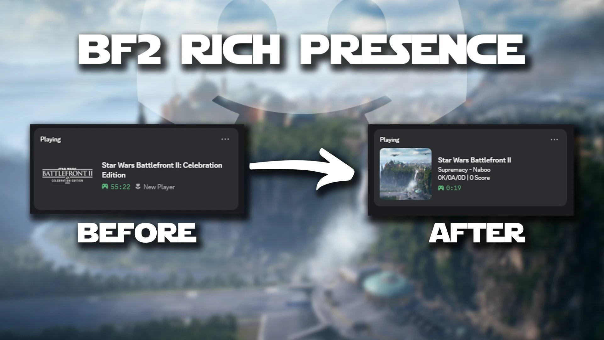
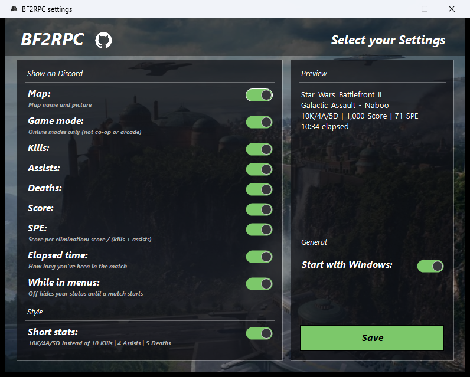

# BF2RPC

Discord Rich Presence for **Star Wars Battlefront II (2017)**.

## Features

- Map, game mode, kills, assists, deaths, score and SPE (score per elimination)
- Settings window to choose what's shown, with a live preview
- Runs in the tray, optional start with Windows

## Usage

1. Download `BF2Presence.exe` from [Releases](https://github.com/Temptations444/bf2rpc/releases).
2. Put it in its own folder and run it with Discord open.
3. Pick your settings. After that it runs in the tray; right-click the icon for Settings or Quit.

If Windows SmartScreen warns about the app, click **More info → Run anyway**.

## Notes

- Game mode isn't available in co-op or Arcade.
- BF2RPC only reads the game's memory and never modifies it, but use it at your own risk.

## Building

Requires Windows and the [.NET 8 SDK](https://dotnet.microsoft.com/download/dotnet/8.0). Run `build.bat`; the exe ends up in `publish\`.
